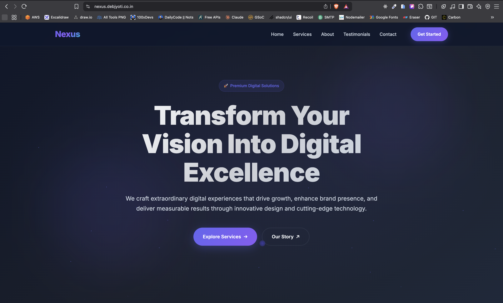
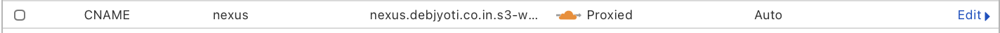
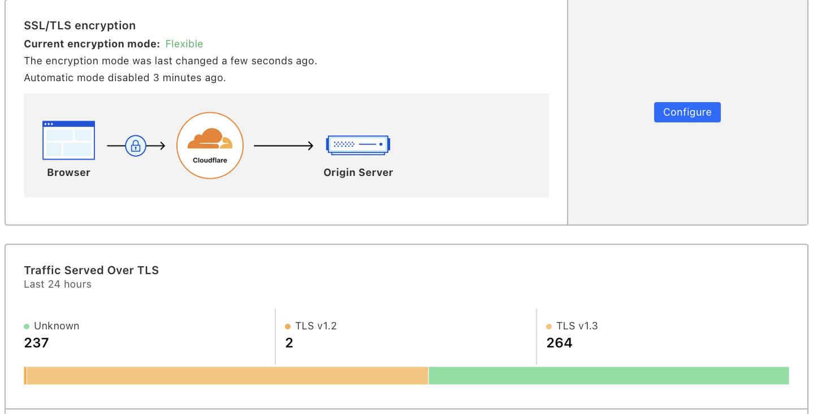
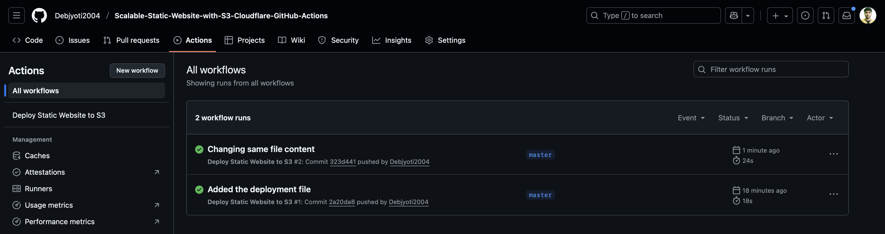
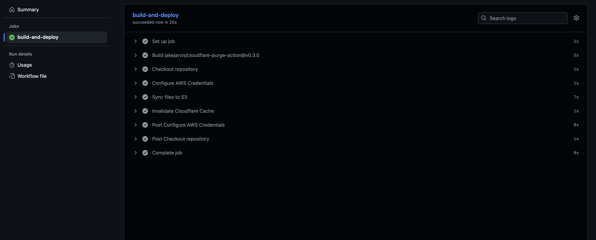

# Scalable Static Website with S3, Cloudflare & GitHub Actions
This project demonstrates a modern, professional, and highly scalable architecture for hosting a static website. It leverages the power of AWS S3 for object storage, Cloudflare for a global CDN and security, and GitHub Actions for a seamless CI/CD pipeline.

The result is a fast, secure, and resilient website that automatically deploys any changes pushed to the main branch—all while utilizing the free tiers of these powerful services. 🚀

## Application Home Page


### Project 1 : `https://github.com/Debjyoti2004/CI-CD-Pipeline-with-GitHub-Actions-Docker`


## Core Technologies
- **Hosting**: AWS S3 (Simple Storage Service)
- **CDN & Security**: Cloudflare (Free Plan)
- **CI/CD**: GitHub Actions
- **Website**: HTML & CSS

## Deployment Architecture
The workflow is simple yet powerful:

1. A developer pushes a code change to the main branch on GitHub.

2. This push automatically triggers a GitHub Actions workflow.

3. The workflow syncs the repository's files to the designated AWS S3 bucket.

4. After the sync is complete, the workflow sends a command to Cloudflare to purge its cache.

5. Visitors immediately see the updated version of the site, served securely and quickly from Cloudflare's nearest edge location.

## Step-by-Step Setup Guide
Follow these steps to replicate this project.
### GitHub Repository Setup
1. Create the Website: Start with a simple `index.html` file for your static site.

2. Initialize Git: Create a new public repository on GitHub and push your initial code.
```sh
git init -b master
git add .
git commit -m "Initial commit"
git remote add origin https://github.com/YOUR_USERNAME/YOUR_REPO_NAME.git
git push -u origin master
```

### AWS S3 Bucket Configuration
1. Create Bucket: In the AWS S3 console, create a new bucket. The bucket name must exactly match your domain/subdomain (e.g., `nexus.debjyoti.co.in`).

2. Disable Public Access Block: Uncheck "Block all public access" during creation and acknowledge the warning.

3. Enable Static Website Hosting:

  - Navigate to the bucket's Properties tab.

  - Enable Static website hosting.

  - Set the Index document to index.html.

  - Copy the Bucket website endpoint URL for later use.

4. Apply Bucket Policy: In the Permissions tab, add the following bucket policy to allow public read access. Remember to replace `your-bucket-name` with your actual bucket name.

```sh
{
    "Version": "2012-10-17",
    "Statement": [
        {
            "Sid": "PublicReadGetObject",
            "Effect": "Allow",
            "Principal": "*",
            "Action": "s3:GetObject",
            "Resource": "arn:aws:s3:::your-bucket-name/*"
        }
    ]
}

```
### CI/CD Pipeline with GitHub Actions
1. Create IAM User: In AWS IAM, create a new user named `github-actions-deployer` with Programmatic access. Attach the `AmazonS3FullAccess` policy. Copy the generated Access key ID and Secret access key.

2. Add GitHub Secrets: In your GitHub repository settings under Secrets and variables > Actions, add the following secrets:
- **AWS_ACCESS_KEY_ID**: Your IAM user's access key.

- **AWS_SECRET_ACCESS_KEY**: Your IAM user's secret key.

- **CLOUDFLARE_ZONE_ID**: Your zone ID from the Cloudflare overview page.

- **CLOUDFLARE_API_TOKEN**: The "Cache Purge" API token you created in Cloudflare.

3. Create Workflow File: Create a file at `.github/workflows/deploy.yml` and add the following code:
```sh
name: Deploy Static Website to S3

on:
  push:
    branches: [ main ] # Or master, depending on your branch name

jobs:
  build-and-deploy:
    runs-on: ubuntu-latest
    steps:
    - name: Checkout repository
      uses: actions/checkout@v3

    - name: Configure AWS Credentials
      uses: aws-actions/configure-aws-credentials@v2
      with:
        aws-access-key-id: ${{ secrets.AWS_ACCESS_KEY_ID }}
        aws-secret-access-key: ${{ secrets.AWS_SECRET_ACCESS_KEY }}
        aws-region: ap-south-1 # Change to your bucket's region

    - name: Sync files to S3
      run: |
        aws s3 sync . s3://your-bucket-name --delete

    - name: Invalidate Cloudflare Cache
      uses: jakejarvis/cloudflare-purge-action@v0.3.0
      env:
        CLOUDFLARE_ZONE: ${{ secrets.CLOUDFLARE_ZONE_ID }}
        CLOUDFLARE_TOKEN: ${{ secrets.CLOUDFLARE_API_TOKEN }}
```

### Cloudflare Configuration
1. Add Site: Add your domain to Cloudflare and select the free plan.

2. Update Nameservers: Go to your domain registrar (e.g., GoDaddy) and replace the default nameservers with the ones provided by Cloudflare.

3. Set DNS Record:

- In the Cloudflare DNS tab, click Add record.

- Type: CNAME

- Name: nexus (or your chosen subdomain)

- Target: The S3 bucket website endpoint URL (without http://).

- Proxy status: Ensure it's Proxied (orange cloud).

4. Configure SSL/TLS:

- Go to the SSL/TLS tab.

- Set the encryption mode to Flexible. This is required because S3 static endpoints do not support HTTPS.

### Final Deployed Website:
Live Site: `nexus.debjyoti.co.in`

### Cloudflare DNS Records:


### Cloudflare SSL/TLS Settings:


### Successful GitHub Action Workflow:


### Deployment Build Logs:
